# 20101549PL-ASSESSMENT3

### Initial Commit
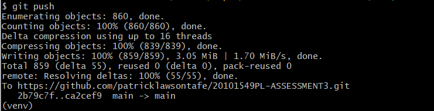


### Identify classes, methods, and attributes
| **Class Name**  | **Attributes** | **Methods** |
|---|---|---|
| ```CarPark```  | location, capacity | add_car, update_displays  |
| ```Sensor``` | id, is_active  | detect_vehicle, update_car_park  |
| ```Display```  | is_on, message  | update, \_\_str\_\_ |

### Added stubs for classes
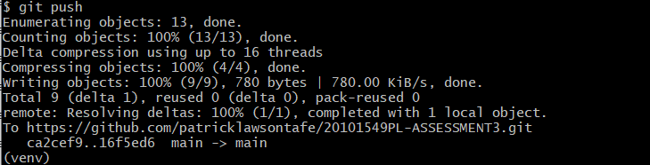

### Tag creation*
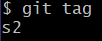

**Github was being uncooperative and didnt create the first tag*

### First Questions

> 1. Which Class is responsible for the number of available bays (and why)?\
    *The CarPark class is responsible. The class holds the capacity of the car park, and a list of plates registered. The remaining bays that can be parked in is calculated by ```capacity - len(plates)```.*

> 2. Which class is responsible for the current temperature (and why)?\
    *The CarPark class has mentioned the temperature but is never actually used there. The Display class is given this information and is used there to display the temperature.*

> 3. Which class is responsible for the time (and why)?\
    *The CarPark class contains code to set the time to ```now()``` which is then used to write into the logs.*


### Second Questions
Answer the following questions:
> **Review Questions**
>
> 1. **Which class is responsible for each of the following pieces of information (and why)?**
>    - _The number of available bays_  
>      `CarPark`
>    - _The current temperature_  
>      `Display`
>    - _The time_  
>      `CarPark`
>
> 2. **What is the difference between an attribute and a property?**  
>    `Attributes are data members of an object, and properties are the accessed methods that perform actions.`
>
> 3. **Why do you think we used a dictionary to hold the data we passed the display? List at least one advantage and one disadvantage of this approach.**  
>    `Each value in the dictionary has a key, which removes the need to use indexing as you can use the keywords in the dictionary to assign them e.g. here this dictionary has a value of 6 and 2, but they have keys assigned to the values:`
>>      food = {'apples':'6','bananas':'2'}
>>      apple_count = food["apples"]
> `A disadvantage to this is that you need to manually input the key into the code most of the time, and using arrays may be better in certain cases.`

### Unit Tests for CarPark Class
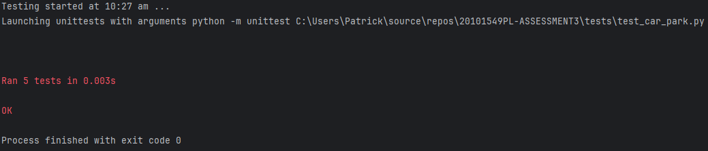

### Unit Tests for Display Class
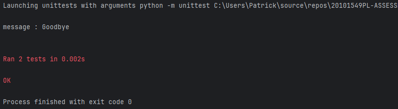

### All other Unit Tests
#### Sensor
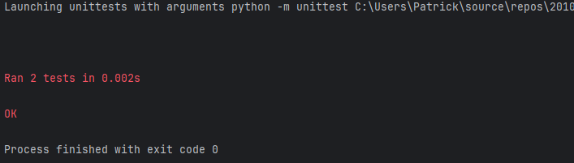
#### CarPark Register
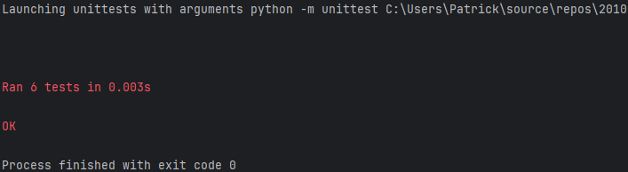
#### CarPark Logs*
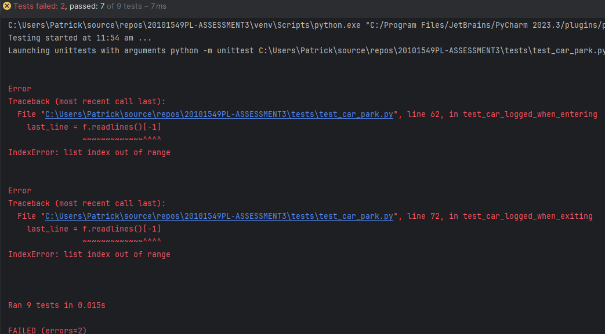\
**Screenshot was lost of all tests passing*

### Q: Should you test it in the CarPark unit tests or the Sensor unit tests? Why?
`insert answer here`

### `main.py` Functionality
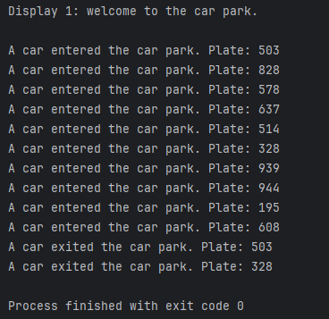

### Release Creation/Publication
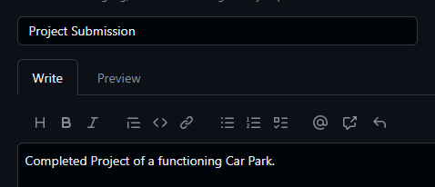
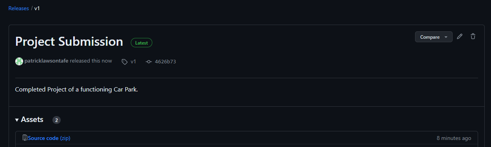